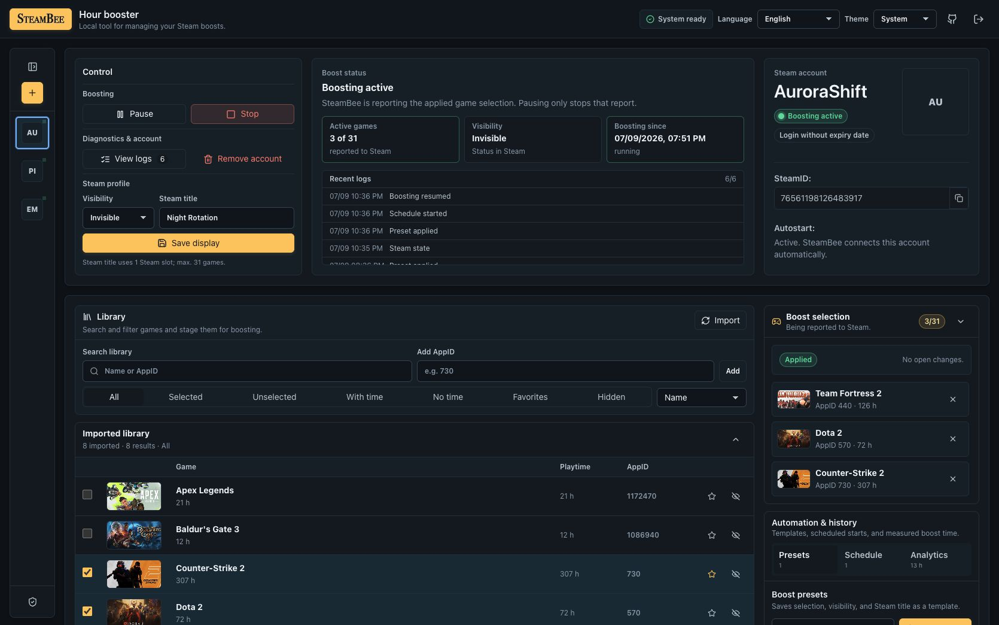
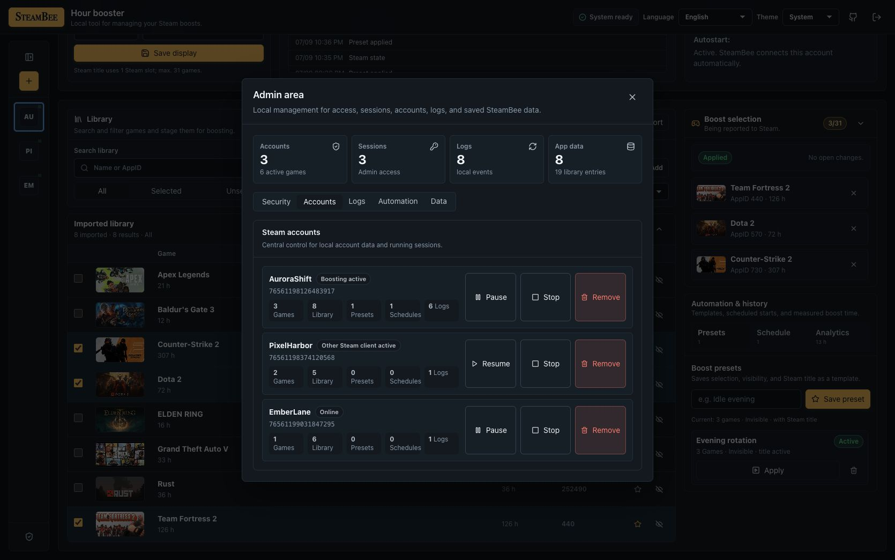
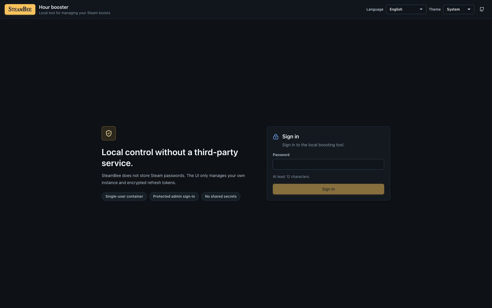

# SteamBee

SteamBee is a self-hosted, single-user Steam hour booster with a Docker-friendly management UI.

It is built for your own Steam accounts in your own container. SteamBee does not store Steam passwords or Steam Guard shared secrets. Steam login uses QR/mobile approval first, with a one-time credential fallback only to obtain an encrypted refresh token.

The repository and container image still use the stable technical slug `steam-bee` for package names, Compose services, volumes, and image tags. The public product name is `SteamBee`.

SteamBee is not affiliated with, endorsed by, or sponsored by Valve Corporation or Steam.

## Screenshots

These screenshots use synthetic demo accounts and fake SteamIDs.







## Features

- One-time-token-protected admin setup with a cookie-based management UI.
- Multiple own Steam accounts in one container.
- QR login via `steam-session`.
- One-time username/password + Steam Guard fallback without password persistence.
- Encrypted refresh-token storage in `/data`.
- Library import with manual AppID fallback.
- Start, pause, resume, and stop per account.
- Persona state and optional custom game title.
- Presets, schedules, session history, and local logs.
- SSE status/log updates.
- Docker Compose setup for a VPS, Unraid, or any generic Docker host.
- Optional prebuilt image deployment through GitHub Container Registry.

## License

SteamBee is licensed under the GNU Affero General Public License v3.0 or later
(`AGPL-3.0-or-later`). The AGPL is a network-copyleft license: if you modify
SteamBee and let users interact with it over a network, you must make the
corresponding source code of that modified version available under the same
license.

Commercial use is allowed when the AGPL is followed. If you need to use,
modify, distribute, host, rebrand, or embed SteamBee without AGPL obligations,
contact the [project owner](https://github.com/ill-yes) for a separate
commercial license.

See [LICENSE](LICENSE), [NOTICE](NOTICE), and
[COMMERCIAL-LICENSE.md](COMMERCIAL-LICENSE.md).

## Local Development

```bash
pnpm install
pnpm dev
```

The server listens on `http://localhost:3000` and serves the built web app in production. In development, run the web app separately if you want Vite HMR:

```bash
pnpm --filter @steam-bee/web dev
```

## Docker Deployment

Requirements:

- Docker Engine with the Docker Compose v2 plugin.
- A Docker host capable of running `linux/amd64` or `linux/arm64` images.
- An HTTPS reverse proxy when SteamBee is exposed beyond a trusted LAN or VPN.

### Prebuilt Image (Recommended)

The public GHCR image is the shortest path for VPS and Unraid deployments. The
included image Compose file is pinned to the current stable release and works
without a `.env` file:

```bash
git clone https://github.com/ill-yes/steam-bee.git
cd steam-bee
docker compose -f compose.image.yml up -d
```

### Build From Source

To build the same runtime image locally instead of pulling it from GHCR:

```bash
git clone https://github.com/ill-yes/steam-bee.git
cd steam-bee
docker compose up --build -d
```

The app is available on `http://127.0.0.1:3000` by default. Compose binds to
localhost so a host-based reverse proxy can publish it safely.

The commands below use the recommended prebuilt-image Compose file. If you
built from source, omit `-f compose.image.yml`.

Useful runtime commands:

```bash
docker compose -f compose.image.yml ps
docker compose -f compose.image.yml logs -f steam-bee
curl -fsS http://127.0.0.1:3000/readyz
docker compose -f compose.image.yml down
```

On a fresh instance, read the one-time setup token from the logs and enter it
with the new admin password:

```bash
docker compose -f compose.image.yml logs steam-bee | grep "SteamBee setup token"
```

The generated token is also stored as `/data/setup.token` with mode `0600` and
is removed after successful setup. It is printed only when first generated;
read the file after a later restart with:

```bash
docker compose -f compose.image.yml exec steam-bee cat /data/setup.token
```

Set `SETUP_TOKEN` only for automated provisioning; environment-provided tokens
are deliberately not printed.

## Optional Configuration

The Compose file works without a `.env` file. Copy `.env.example` to `.env` only when you need local overrides:

```bash
cp .env.example .env
```

Runtime defaults:

- `STEAM_BEE_BIND=127.0.0.1`
- `STEAM_BEE_PORT=3000`
- `TRUST_PROXY=false`
- `COOKIE_SECURE=false`
- `LOG_LEVEL=info`
- `LOG_REQUESTS=true`
- `LOG_QUIET_REQUESTS=true`
- `EVENT_RETENTION_DAYS=90` (`0` disables cleanup)
- `DOCKER_LOG_MAX_SIZE=10m`
- `DOCKER_LOG_MAX_FILE=3`

Container-internal values stay fixed at `HOST=0.0.0.0`, `PORT=3000`, and `DATA_DIR=/data`.

For a LAN-accessible Unraid or VPS setup without a local reverse proxy, only set `STEAM_BEE_BIND=0.0.0.0` on a trusted LAN or VPN. The setup token prevents an unauthenticated first visitor from claiming a fresh instance, but the login endpoint still belongs behind an HTTPS reverse proxy for internet access.

## Image Versions

`compose.image.yml` defaults to `ghcr.io/ill-yes/steam-bee:1.0.3`. Override the
pin in `.env` when you want to select another release:

```bash
STEAM_BEE_IMAGE=ghcr.io/ill-yes/steam-bee:1.0.3
```

Exact version tags are recommended for repeatable deployments. Image tags do
not include the Git tag's `v` prefix: `1.0` tracks the latest `1.0.x` patch,
`latest` tracks the newest stable release, and `edge` tracks `main`.

The included GitHub Actions workflow verifies formatting, types, tests,
dependency and image vulnerabilities, Compose parity, runtime UID/GID, an
amd64 image smoke test, and multi-architecture builds. `main` publishes only
`edge` and `sha-*`; a Git tag such as `v1.0.3` publishes `1.0.3`, `1.0`, and
`latest` for `linux/amd64` and `linux/arm64`. Published images include SBOM,
provenance, and a GitHub artifact attestation. Manual workflow runs build but
does not publish. The GHCR package is public and can be pulled without
authentication.

Verify a published image against this repository with the GitHub CLI:

```bash
gh attestation verify oci://ghcr.io/ill-yes/steam-bee:1.0.3 \
  --repo ill-yes/steam-bee
```

## Reverse Proxy

For a reverse proxy running directly on the Docker host, keep the default
localhost binding and point the proxy at `127.0.0.1:3000`.

For a reverse proxy running in another container, attach both services to the
same external Docker network and use `steam-bee:3000` as the upstream. For
example, create `compose.proxy.yml`:

```yaml
services:
  steam-bee:
    networks:
      - proxy

networks:
  proxy:
    external: true
```

Create the network once and include the override when starting SteamBee:

```bash
docker network create proxy
docker compose -f compose.image.yml -f compose.proxy.yml up -d
```

Use the existing external network name instead of `proxy` when your Caddy,
Nginx Proxy Manager, SWAG, or Traefik installation already provides one.

When the public URL uses HTTPS behind exactly one reverse proxy, set these
values in `.env`:

```bash
TRUST_PROXY=1
COOKIE_SECURE=true
```

`TRUST_PROXY` accepts a positive proxy-hop count or a comma-separated list of
trusted IP addresses/CIDRs. Do not expose the application port directly when
proxy trust is enabled, and configure the proxy to replace forwarded headers
instead of appending untrusted client values.

Keep response buffering disabled in Nginx-compatible proxies so SSE status and
log updates are delivered immediately. SteamBee also sends
`X-Accel-Buffering: no` on SSE responses.

## Persistent Data

Compose mounts `/data` as the named volume `steam-bee-data`. It contains SQLite state, the instance encryption secret, encrypted Steam refresh tokens, and Steam client data. Do not bind this to the repository unless you know exactly what you are doing.

The container root filesystem is read-only. Only `/data` and the bounded `/tmp`
tmpfs are writable, and Docker's `json-file` logs rotate by default.

Named volumes are the supported default. On Unraid, you can replace the volume with an appdata bind mount if you want direct host-side backups:

```yaml
volumes:
  - /mnt/user/appdata/steambee:/data
```

The container runs as UID/GID `10001`. Make sure the bind-mounted directory is writable by that user, and never point `/data` at the checked-out repository.

The commands below use `compose.image.yml`. If you built from source, omit
`-f compose.image.yml`. The local `backups/` directory is ignored by Git and
the Docker build context, but backup archives still contain sensitive instance
data and should be stored securely outside the repository after creation.

Create a backup while the service is stopped:

```bash
mkdir -m 700 -p backups
docker compose -f compose.image.yml stop steam-bee
docker compose -f compose.image.yml run --rm --no-deps --user 0:0 \
  --cap-add CHOWN --cap-add DAC_OVERRIDE --cap-add FOWNER \
  -v "$PWD/backups:/backup" steam-bee \
  sh -c 'umask 077; tar czf /backup/steam-bee-data-$(date +%Y%m%d-%H%M%S).tgz -C /data .'
docker compose -f compose.image.yml up -d
```

Restore a backup:

```bash
docker compose -f compose.image.yml down
docker compose -f compose.image.yml run --rm --no-deps --user 0:0 \
  --cap-add CHOWN --cap-add DAC_OVERRIDE --cap-add FOWNER \
  -v "$PWD/backups:/backup:ro" steam-bee \
  sh -c 'find /data -mindepth 1 -maxdepth 1 -exec rm -rf -- {} + && tar xzf /backup/<backup-file>.tgz -C /data && chown -R 10001:10001 /data'
docker compose -f compose.image.yml up -d
```

## Updates

Source build:

```bash
git pull
docker compose up --build -d
docker compose logs -f steam-bee
```

Prebuilt image:

If you rely on the pinned default in `compose.image.yml`, run `git pull` to
receive the new release pin. If `.env` sets `STEAM_BEE_IMAGE`, update that value
to the desired version before pulling.

```bash
git pull
docker compose -f compose.image.yml pull
docker compose -f compose.image.yml up -d
docker compose -f compose.image.yml logs -f steam-bee
```

## Git Hygiene

Never commit local runtime state or secrets. `.env`, `data/`, `backups/`,
SQLite files, Steam client data, build outputs, and local screenshots are
ignored. Before committing, these checks should be clean:

```bash
git check-ignore -v .env .env.local data apps/server/data screenshots backups
git ls-files -- data .env apps/server/data screenshots backups
```

The second command should print nothing.

Public documentation screenshots belong in `docs/screenshots/` and must use synthetic accounts only.

## Contributing

Read [CONTRIBUTING.md](CONTRIBUTING.md) and [CLA.md](CLA.md) before opening a
pull request.

## Project Documentation

- [PRODUCT.md](PRODUCT.md) defines the target users, product boundaries, and operating model.
- [DESIGN.md](DESIGN.md) documents the interface principles and visual system.
- [docs/TRANSLATIONS.md](docs/TRANSLATIONS.md) explains locale ownership and the community-translation status.
- [SECURITY.md](SECURITY.md) covers supported deployment boundaries and vulnerability reporting.

## Security

Read [SECURITY.md](SECURITY.md) before exposing SteamBee outside localhost.

Security boundaries:

- No hosted multi-user mode.
- No Steam password persistence.
- No Steam Guard shared-secret persistence.
- No Docker socket or shell command surface.
- No forced kicking of real Steam sessions.
- No Valve or Steam affiliation.

Use at your own risk. Steam and game-specific rules can change, and automation may have account or platform consequences.
